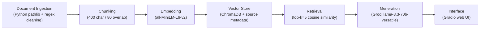

# Project 1 Planning: The Unofficial Guide

> Write this document before you write any pipeline code.
> Your spec and architecture diagram are what you'll use to direct AI tools (Claude, Copilot, etc.) to generate your implementation — the more specific they are, the more useful the generated code will be.
> Update the Retrieval Approach and Chunking Strategy sections if you change your approach during implementation.
> Update this file before starting any stretch features.

---

## Domain

Riverside State University (RSU) campus dining — student reviews, wait times, meal plan advice, dietary options, and late-night food across dining halls, cafes, food trucks, and convenience stores. This knowledge is valuable because official RSU dining pages list hours and menus but not real wait times, which dining hall has the best vegetarian food, or whether the unlimited meal plan is worth the cost. Students currently piece this together from scattered Reddit threads, Yelp reviews, and word of mouth. A searchable guide lets new students answer specific questions ("Where should I eat lunch near the engineering building?" or "What's open after 10 PM?") without digging through dozens of forum posts.

---

## Documents

| # | Source | Description | URL or location |
|---|--------|-------------|-----------------|
| 1 | r/RSU subreddit | North Dining Hall student reviews and ratings | `documents/north_hall_reviews.txt` |
| 2 | RSU student wiki | South Quad Cafe menu, hours, and Yelp reviews | `documents/south_quad_cafe.txt` |
| 3 | RSU student forum | West Market reviews from engineering students | `documents/west_market_reviews.txt` |
| 4 | RSU Student Government | East Commons dining survey results (412 responses) | `documents/east_commons_dining.txt` |
| 5 | Unofficial survival guide | Meal plan tier comparison and money-saving tips | `documents/meal_plan_guide.txt` |
| 6 | Plant-Based Students Club | Vegetarian and vegan options at every location | `documents/vegetarian_vegan_options.txt` |
| 7 | r/RSU megathread | Late-night eating options after 9 PM | `documents/late_night_eating.txt` |
| 8 | Campus Life Blog | Weekend brunch guide for East Commons and North Hall | `documents/brunch_weekend_dining.txt` |
| 9 | Student Activities page | Food truck weekly schedule and student tips | `documents/food_trucks_campus.txt` |
| 10 | Crowdsourced spreadsheet | Wait times by location, meal period, and day | `documents/dining_wait_times.txt` |
| 11 | r/RSU pinned post | Budget eating tips and cheapest meals on campus | `documents/budget_eating_tips.txt` |
| 12 | Student Notion guide | Coffee quality and study spot rankings | `documents/coffee_study_spots.txt` |

---

## Chunking Strategy

**Chunk size:** 400 characters

**Overlap:** 80 characters

**Reasoning:** My documents mix short individual reviews (1–3 sentences) with longer guide sections (multiple paragraphs). At 400 characters, each chunk holds roughly 2–4 sentences — enough to capture a complete student opinion or a specific fact (e.g., a wait time for a particular dining hall at a particular time) without merging unrelated topics. Overlap of 80 characters (20%) ensures that facts spanning a sentence boundary — like "North Hall lunch peak wait is 18–25 minutes at the stir-fry station" — appear intact in at least one chunk even if the split falls mid-sentence. Chunks smaller than 200 characters would fragment reviews into meaningless fragments ("Professor Smith's exams are heavily"). Chunks larger than 600 characters would merge distinct topics (wait times + meal plan advice + vegetarian options) and dilute embedding signal, causing retrieval to return loosely related content for specific queries.

---

## Retrieval Approach

**Embedding model:** `all-MiniLM-L6-v2` via `sentence-transformers` — runs locally, no API key, fast enough for ~100–200 chunks.

**Top-k:** 5

**Production tradeoff reflection:** If cost were not a constraint, I would evaluate `all-mpnet-base-v2` (higher accuracy on semantic similarity), OpenAI `text-embedding-3-small` (better on short informal text like student reviews), or a domain-fine-tuned model. Tradeoffs to weigh: `all-MiniLM-L6-v2` has a 256-token context limit (fine for my 400-char chunks) but may miss nuance in slang-heavy review text; larger models add latency (50–200ms per query vs. ~10ms local); API-hosted models add per-query cost and require network calls. For a campus dining guide with English-only content and <500 chunks, local MiniLM is the right starting point. I would increase top-k to 7–8 in production if user queries are broad (e.g., "best food on campus") but keep k=5 for specific questions to avoid diluting the LLM context.

---

## Evaluation Plan

| # | Question | Expected answer |
|---|----------|-----------------|
| 1 | What are the wait times at North Dining Hall during lunch peak? | 18–25 minutes at stir-fry and grill stations between 11:45 AM and 1:15 PM; salad bar is 5–8 minutes. |
| 2 | Which dining hall is best for vegan students? | East Commons, rated 4.5/5 by the Plant-Based Students Club, with a dedicated plant-based station and allergen-free meals. |
| 3 | What late-night food options are available on campus after 9 PM? | West Market (open until 11 PM), Night Owl food truck (9 PM–1 AM Thu–Sat at library plaza), and the 24-hour Student Union convenience store. |
| 4 | Is the unlimited meal plan worth it? | Only if you eat on campus more than 14 meals per week; otherwise the 14-meal plan saves ~$550/semester. |
| 5 | Where can I get the best coffee on campus for studying? | South Quad Cafe — best espresso on campus (4.5/5 study rating), with outlets at every table. |

---

## Anticipated Challenges

1. **Chunks splitting key facts across boundaries:** A wait time statistic might span two sentences (e.g., "Lunch peak at North Hall" in one chunk and "18–25 minutes at stir-fry" in the next). The 80-character overlap mitigates this, but retrieval for very specific queries could still return only partial context. I will inspect chunks manually before embedding to catch this.

2. **Noisy or overlapping content across documents:** Multiple documents mention wait times, vegetarian options, and meal plans with slightly different details. Retrieval might return chunks from the wrong source (e.g., West Market wait times when the user asked about North Hall). Source metadata on each chunk is critical for attribution and debugging.

3. **Informal student language:** Reviews use slang, abbreviations, and Reddit usernames. The embedding model may not strongly connect "North Hall" with "North Dining Hall" or "the big dining hall by freshman dorms." Test queries using different phrasings will reveal this.

---

## Architecture

**Pipeline stages and tools:**

| Stage | Tool / Library |
|-------|---------------|
| Document Ingestion | Python `pathlib`, regex HTML/boilerplate cleaning |
| Chunking | Custom sliding-window splitter (`chunk.py`) |
| Embedding | `sentence-transformers` — `all-MiniLM-L6-v2` |
| Vector Store | ChromaDB (persistent, local `chroma_db/`) |
| Retrieval | ChromaDB query + cosine distance |
| Generation | Groq API — `llama-3.3-70b-versatile` |
| Interface | Gradio 6.9+ web UI |

---

## AI Tool Plan

**Milestone 3 — Ingestion and chunking:**

I will give Cursor my Documents section (12 local `.txt` files in `documents/`), Chunking Strategy section (400 chars, 80 overlap), and Architecture diagram. I expect it to produce `ingest.py` (load files, strip source headers, clean whitespace) and `chunk.py` (sliding-window chunker with metadata: source filename, chunk index). I will verify by printing one cleaned document and 5 sample chunks, checking that each chunk is self-contained and no HTML artifacts remain.

**Milestone 4 — Embedding and retrieval:**

I will give Cursor my Retrieval Approach section (all-MiniLM-L6-v2, top-k=5, ChromaDB) and the architecture diagram. I expect `embed.py` (embed all chunks, store in ChromaDB with source metadata) and `retrieve.py` (query function returning top-k chunks with distance scores). I will verify by running 3 evaluation questions and checking that returned chunks are on-topic with distance scores below 0.5.

**Milestone 5 — Generation and interface:**

I will give Cursor my grounding requirements (answer only from context, cite sources, say "I don't have enough information" when context is insufficient), the Gradio skeleton from the project instructions, and my `.env` Groq setup. I expect `query.py` (end-to-end `ask()` function) and `app.py` (Gradio UI). I will verify by testing 2 grounded queries and 1 out-of-scope query, confirming the system declines to hallucinate.
